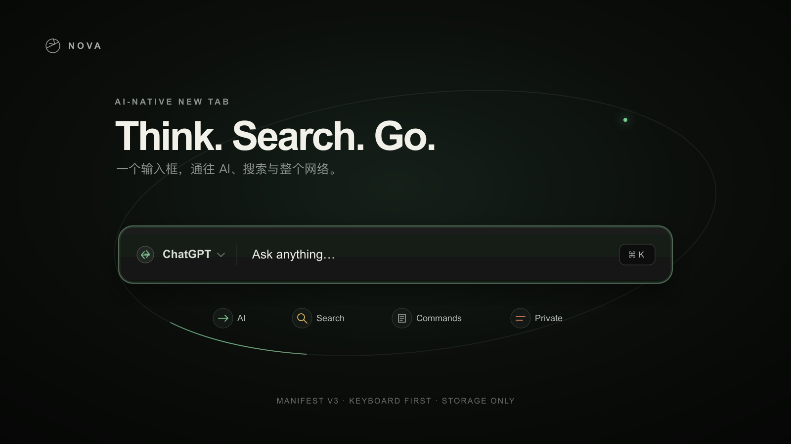
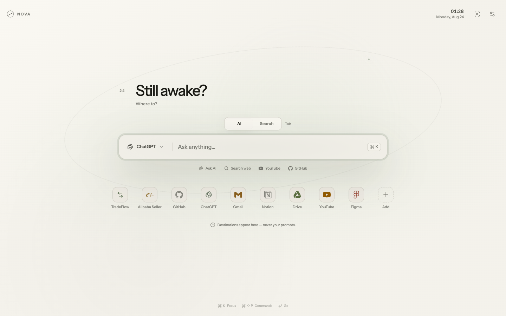
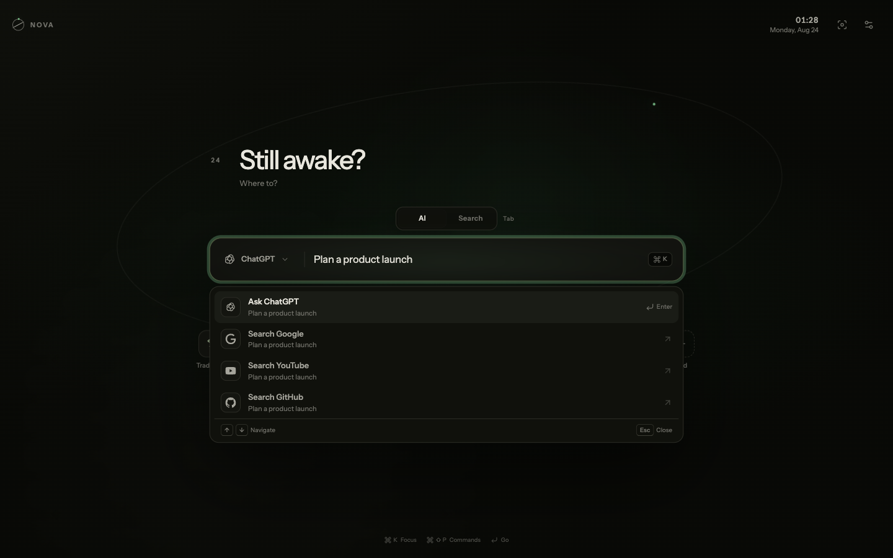
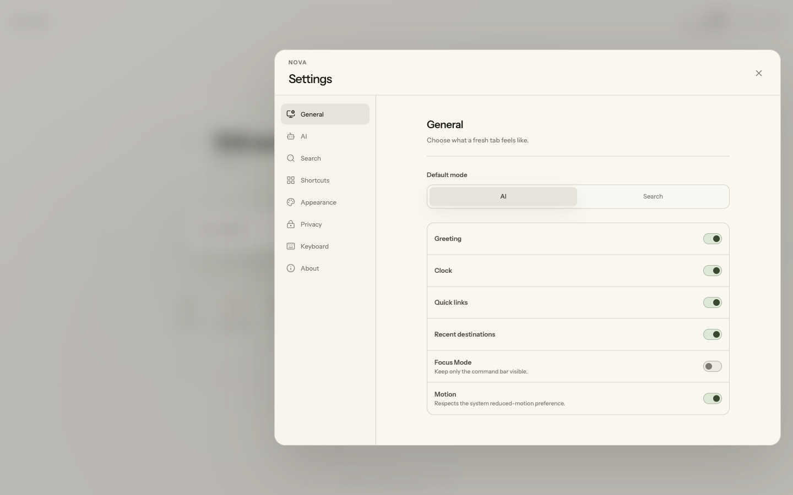

<div align="center">
  

  <br />

  **A calm, keyboard-first new tab for AI, search, and the web.**

  [English](README.md) · [简体中文](README.zh-CN.md) · [Watch the real-browser demo](docs/assets/nova-demo.mp4)

  
  
  
  
</div>

NOVA turns every browser new tab into one universal launch surface. Ask an AI, search the web, open a URL, run a calculation, or jump to a favorite site without changing context.



## Why NOVA

- **One command bar:** AI, search, URLs, calculations, and slash commands share one predictable input.
- **Real destinations, no proxy:** NOVA hands work to ChatGPT, Claude, Gemini, Perplexity, Grok, DeepSeek, Google, GitHub, YouTube, and more.
- **Built for the keyboard:** `⌘/Ctrl K` focuses the launcher, `Tab` switches AI/Search, and `⌘/Ctrl ⇧ P` opens the command palette.
- **Your own launchpad:** add, edit, remove, undo, and drag up to 12 quick links.
- **Calm by design:** light, dark, system themes, five restrained accents, Focus Mode, and reduced-motion support.
- **Privacy by construction:** no analytics, no API keys, no prompt history, and only the `storage` extension permission.



## Install

### From a release

1. Download `nova-ai-new-tab-v0.1.2.zip` from [Releases](../../releases).
2. Unzip it.
3. Open `chrome://extensions` in Chrome, Edge, Brave, or another Chromium browser.
4. Enable **Developer mode**.
5. Choose **Load unpacked** and select the unzipped folder.
6. Open a new tab and finish the three-step setup.

### From source

```bash
git clone https://github.com/CalvinQin/nova-ai-new-tab.git
cd nova-ai-new-tab
npm ci
npm run build
```

Then load the generated `dist/` folder from `chrome://extensions`.

## Supported destinations

| AI | Search |
| --- | --- |
| ChatGPT, Claude, Gemini, Perplexity, Grok, DeepSeek, 豆包, Kimi, 通义千问, 腾讯元宝 | Google, 百度, Bing, DuckDuckGo, Brave, YouTube, GitHub, Reddit, Bilibili, Zhihu, Xiaohongshu, Taobao |

Providers with a stable query URL receive the prompt directly. For providers without one, NOVA copies the prompt and opens the official site so you can paste it yourself.

## Commands

Type `/` to discover commands such as `/chatgpt`, `/google`, `/youtube`, `/github`, `/settings`, `/theme`, `/apps`, and `/focus`.

| Shortcut | Action |
| --- | --- |
| `⌘/Ctrl K` | Focus the universal command bar |
| `Tab` | Switch between AI and Search |
| `↑` / `↓` | Move through suggestions |
| `Enter` | Run the selected action |
| `⌘/Ctrl ⇧ P` | Open the command palette |
| `Esc` | Close or clear the current surface |



## Privacy

NOVA stores settings, quick links, and recent **destination metadata** locally with `chrome.storage.local`. It deliberately does not save prompt or search text. It has no host permissions, background worker, analytics, remote code, or AI API credentials. See [PRIVACY.md](PRIVACY.md).

## Development

```bash
npm run dev      # local Vite development
npm run check    # ESLint + 43 tests + production build
npm run icons    # regenerate extension icons
npm run store:assets # regenerate and verify Chrome Web Store artwork
```

Built with React, TypeScript, Vite, Zustand, Framer Motion, dnd-kit, Lucide, and Simple Icons. The production package targets Chrome Manifest V3.

See [Architecture](docs/ARCHITECTURE.md) for the product flow, component boundaries, privacy model, and extension points.

## Contributing

Issues and focused pull requests are welcome. Please read [CONTRIBUTING.md](CONTRIBUTING.md) before contributing.

## License

[MIT](LICENSE) © 2026 Haoqi Qin.
